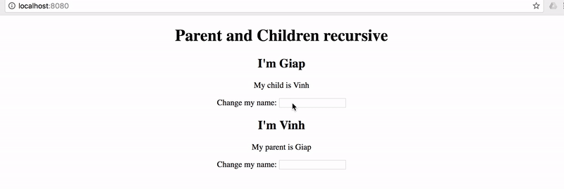

# nqlx
Graph based state management. Borrow ideas from polular state management solutions: Mobx, Vuex, Redux and Relay. It also reuse query syntax from my own project NextQL.

## Core Concepts

nqlx is very simple. It is centralized store for all the components in an application. But unlike most of state management solutions, nqlx works as a in-memory database: **internal data should not read or write directly instead of be copied in and out.**. This ensuring that the state can only be accessed or mutated in a predictable fashion. This also ensuring that nqlx able tracking every state changes or access.

But differ a in-memory database, nqlx not normalize input data. It copy and merge exactly input data (except array) with internal state **included object's reference and recursive.**. So mutate nqlx's internal state is nearly same with mutate normal Javascript objects.

Read state out nqlx is quite different. Actually you don't read a state but it's derivations. **Read state is a tree based without object reference and recursive.** This concept is important for watch and reactive state changed.

1. Application state are inputed as a graphs of objects with references and recursive.
2. Read states are derivations from application state which query as a tree 
3. Read states re-computed and notified if contains nodes changed after a mutation.

|input graph objects| merge and notify| update output tree|
| ------------- | ------------- | ---- |
|   |   | |

## Demo
```js
const parent = {
	name: "Giap"
};

const child = {
	name: "Vinh"
};

parent.child = child;
child.parent = parent;
store.put({
	parent,
	child
});

//Watch parent
store.watch({ 
	parent: {
		name: 1,
		child: {
			name: 1
		}
	}
}, val => console.log(val));

//Watch child
store.watch({ 
	child: {
		name: 1,
		parent: {
			name: 1
		}
	}
}, val => console.log(val));

//Update parent name which notify both watches
store.put({
	parent: {
		name: evt.target.value
	}
});

//Update child name which notify both watches
store.put({
	child: {
		name: evt.target.value
	}
});

```




## API
```js
const Database = require("nqlx");
const store = new Database();
```

### store.put(state)
Copy and merge state with internal state. Notify changes for dependency watches.

### store.get(query)
Copy state from internal state use NextQL-liked query.

### store.watch(query, cb) -> unsubcribe
Same with store.get but any changes affect query's result will notify via cb. The function return an unsubcrible function which should be called to stop watching.


