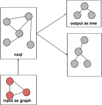
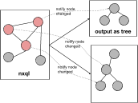

# nqlx
Graph based state management. Borrow ideas from polular state management solutions: Mobx, Vuex, Redux and Relay. It also reuse query syntax from my own project NextQL.

# Core Concepts
nqlx is very simple. It is centralized store for all the components in an application. But unlike most of state management solutions, nqlx works as a in-memory database: **internal data should not read or write directly instead of be copied in and out.**. This ensuring that the state can only be accessed or mutated in a predictable fashion. This also ensuring that nqlx able tracking every state changes or access.

But differ a in-memory database, nqlx not normalize input data. It copy and merge exactly input data (except array) with internal state **included object's reference and recursive.**. So mutate nqlx's internal state is nearly same with mutate normal Javascript objects.

Read state out nqlx is quite different. Actually you don't read a state but it's derivations. **Read state is a tree based without object reference and recursive.** This concept is important for watch and reactive state changed.

1. Application state are inputed as a graphs of objects with references and recursive.
2. Read states are derivations from application state which query as a tree 
3. Read states re-computed and notified if contains nodes changed after a mutation.

* Input a graph into nxql

 

* nxql merge input graph with current state and notify read state which contains effect nodes

 

* read states updated

